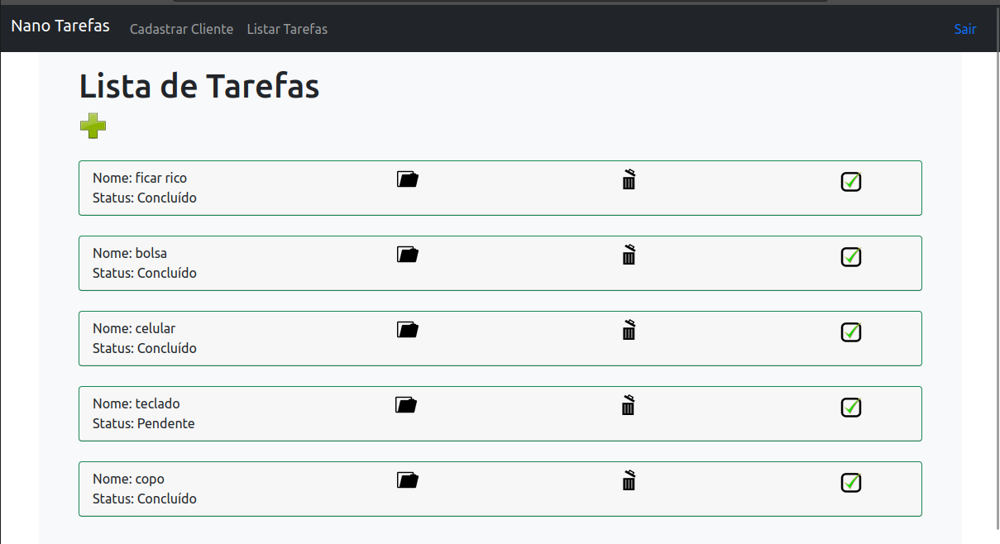

# Sistema de Gerenciamento de Tarefas

# 🔨 Em Construção ⚠️



>Protótipo para criar e gerenciar tarefas.

## Requisitos de Projeto

* ✅ Autenticação de usuário: os usuários precisam se registrar e fazer login antes de acessar as tarefas.

* ✅ CRUD de tarefas: os usuários podem criar, ler, atualizar e excluir tarefas.

* ✅ Boas práticas de programação: o código deve ser claro, legível, e seguir as diretrizes da pep-8.

* ⏳ UI amigável: a interface deve ser fácil de usar e deve seguir boas práticas de design de UI.

* ⏳ Testes Unitários para garantir a integridade da aplicação.

<hr>

## Tecnologias Utilizadas


<hr>

## 🚀 Processo de Instalação

Para instalar **task_management**, siga estas etapas:

`Linux:`

Clone o Repósitorio :
```
git clone https://github.com/Wenderson-Oscar/Task_Manager.git
```
Crie o Ambiente Virtual:
```
virtualenv env
```
Ative o Ambente Virtual:
```
. env/bin/activate
```
Baixando as Dependencias:

```
pip install -r requirements.txt
```

<hr>

`Windows:`

Clone o Repósitorio :
```
git clone https://github.com/Wenderson-Oscar/Task_Manager.git
```
Crie o Ambiente Virtual:
```
python -m venv env
```
Ative o Ambente Virtual:
```
env\Scripts\activate
```
Baixando as Dependencias:

```
pip install -r requirements.txt
```


## Se for a Primeira vez Clonando um Repositório Teremos que criar a SECRET_KEY

<hr>

## Como criar a `SECRET_KEY` após clonar um repositório Git

A `SECRET_KEY` é uma chave secreta que é usada para criptografar e descriptografar informações confidenciais em um aplicativo Django. É importante manter a `SECRET_KEY` em segurança e não compartilhá-la publicamente em um repositório Git.

Se você clonou um repositório Git que não possui a `SECRET_KEY`, é importante criá-la para que a aplicação Django funcione corretamente. Aqui está um tutorial passo a passo sobre como criar a `SECRET_KEY` após clonar um repositório Git:

## Passo 1: Acesse o diretório do projeto

Após clonar o repositório Git, acesse o diretório do projeto no seu terminal ou prompt de comando usando o comando `cd` ou então pode usar a interface do OS.

```
cd/caminho/para/o/projeto
```

Substitua `/caminho/para/o/projeto` pelo caminho para o diretório do projeto no seu computador.

## Passo 2: Crie um arquivo `.env`

depois de ter entrado no ambiente virtual (caso não saiba no início desse README tem o comando).

O arquivo `.env` é usado para armazenar variáveis de ambiente, como a `SECRET_KEY`.

## Passo 3: Gerar a SECRET_KEY

Abra um navegador da web e acesse um gerador de chaves aleatórias, como o [Djecrety](https://djecrety.ir/).

Clique no botão "Generate Secret Key" para gerar uma nova chave aleatória.

Copie a chave gerada.

## Passo 4: Adicione a SECRET_KEY ao arquivo `.env`

Abra o arquivo `.env` em pyvenv.cfg e adicione a `SECRET_KEY` usando o seguinte formato:

também colocaremos o DEBUG 

```
DEBUG = false
SECRET_KEY = "sua_secret_key_aqui"
```
colocamos false mais se preferir pode colocar true, fique a sua escolha.
<br>
(lembrando que o true e false no DEBUG, controla as mensagens de erro que são exibidas.
true = exibe as informações detalhada de erro, false = exibe erros genéricos)

Substitua `sua_secret_key_aqui` pela chave gerada no passo 3.

Salve e feche o arquivo.

## Passo 5: Adicione o arquivo `.env` ao arquivo `.gitignore`

Para evitar que o arquivo `.env` seja incluído no repositório Git, adicione-o ao arquivo `.gitignore`. Se o arquivo `.gitignore` não existir, crie-o .

``` sh
touch .gitignore
```

Salve e feche o arquivo.

Agora a sua `SECRET_KEY` está armazenada com segurança em um arquivo `.env` que não será compartilhado publicamente em um repositório Git.

# ☕ Como Utlizar a Aplicação

## Para usar **task_management**, siga estas etapas:

Crie o Banco de Dados:
```
python manage.py migrate 
```
Crie o Super Usuário:
```
python manage.py createsuperuser
```
Inície o Servidor: 
```
python manage.py runserver
```
`Aproveite.`